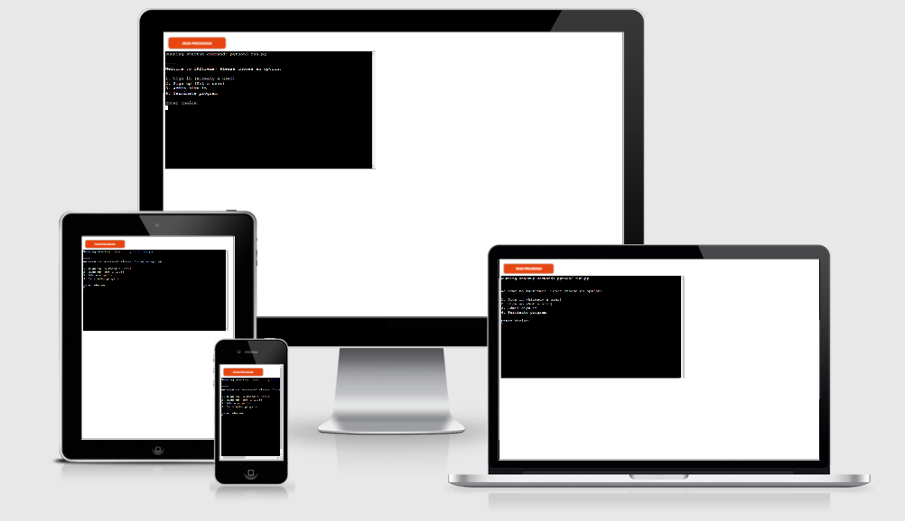
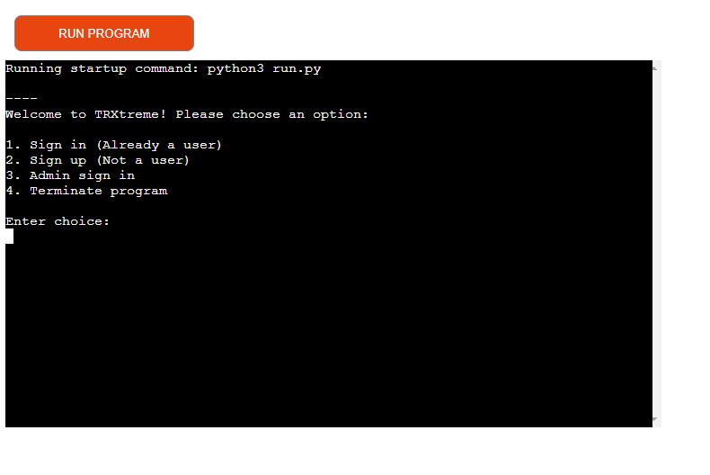
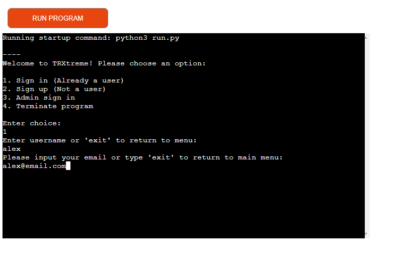

# TRXtreme Booking System
In order to view the live site, click [here](https://trxtreme.herokuapp.com/).

If you want to view the Google Calendar, click [here](https://calendar.google.com/calendar/u/0?cid=dHJ4dHJlbWUyMDIxQGdtYWlsLmNvbQ). To view, you have to add the calendar to your Google account. You can remove it anytime you wish after that.

If you want to view the Google Sheet used for data storage, click [here](https://docs.google.com/spreadsheets/d/1izyPTgGIt_uKegNn2I0lFUdrAuXPJisNeXgvzN2EG_g/edit?usp=sharing).

TRXtreme is a booking system for a martial arts school that also offers TRX and Cross Training workouts. 
The system was built based on a real place and the way it works, coupled with many personal preferences/improvements. 
It offers options for first time users, signed up users and administrators.

## Table of contents:

1. [User Stories](#user-stories)
2. [Goals](#goals)
3. [Features](#features)
4. [Design](#design)
    1. [Colours](#colours)
    2. [Fonts](#fonts)
    3. [Structure](#structure)
    4. [Wireframes](#wireframes)
5. [Technologies used](#technologies-used)
6. [Testing](#testing)
    1. [Validation](#validation)
    2. [Device and browser testing](#device-and-browser-testing)
    3. [User stories testing](#user-stories-testing)
7. [Bugs](#bugs)
8. [Deployment](#deployment)
9. [Credits](#credits)

## User Stories:

### As a first time user, I want to:
1. Be able to sign up.
2. Be able to see my data after signing up.
3. Have the option to sign up for the appropriate martial arts level.
4. Find the menu options easily.

### As a recurring martial arts user, I want to:
5. Have easy sign in option.
6. See my next martial arts class.

### As a recurring workouts user, I want to:
7. Have easy sign in option.
8. See how many workouts I have left. 
9. Not be able to register for the same workout twice.

### As the administrator, I want to:
10. Be able to see registered users for specific classes.
11. Have the option to view user data.
12. Have the option to edit user data.

## Goals:
### Development goals:
* Have an efficient way to store data and use it.
* Use both Google Calendar and Sheet to have better structure.
* Provide easy navigation that can escape back to main menu.

### Target audience goals:
* Provide an intuitive menu.
* Have easy to understand options.
* Provide options for both administrators and users.

## Features:

### Main menu:

* Provides welcome message. 
* Gives users and administrators the options.

#### User stories covered: 4

### User sign in:

* Asks users for their username and email.
* Informs them if the username or email is incorrect.
* Provides escape option.

#### User stories covered: 5, 7

### Workout user options menu:

* Asks users for their username and email.
* Informs them if the username or email is incorrect.
* Provides escape option.

#### User stories covered: 5, 7

## Design:

DESIGN INFO

### Colours:

### Fonts:
FONTS INFO

### Structure: 
STRUCTURE INFO

### Wireframes:

PAGE NAME

## Technologies used:

### Languages
  * LANGUAGE

### Frameworks and tools
  * FRAMEWORK

## Testing:
### Validation

 HTML 

The W3C Markup Validation Service was used to validate HTML code. All pages passed with no errors or warnings to show.

### Home:

 CSS 

The W3C CSS Validation Service (Jigsaw) was used to validate CSS code.   
When performing the URI validation, we get 12 errors and many warnings. Those errors and warnings are related to Bootstrap.  
If we perform the code validation, we can see that there are no errors or warnings, as seen in the images below.  

### URI validation:

### Code validation:

 Performance 

Website performance was tested with Google Developer Tools Lighthouse.   
All pages passed the tests with near perfect results.

### Home:

 Accessibility 

Website accessibility was tested with the WAVE Web Accessibility Evaluation Tool.  
All pages passed with no errors. 

### Home:

### Device and browser testing

The website was tested on the following devices:
* Windows desktop PC (various components) running Windows 10
  * Chrome Version 92.0.4515.159
  * Edge Version 92.0.902.78
* iPhone 12 Pro
  * Safari 
* Various devices from users who tested for feedback

The webpage works great on all devices and browsers that it was tested on.  
Functionality between desktop and mobile remains the same, with the look of the page changing slightly.  
As the website was designed mobile-first, it fits mobile browsers perfectly while also changing to fit a larger screen and occupy more space.

### User stories testing:

1. USER STORY

| **Feature** | **Action** | **Expected Result** | **Actual Result** |
|-------------|------------|---------------------|-------------------|
| FEATURE | ACTION | EXPECTED RESULT | Works as expected |

Screenshots

## Bugs

1. BUG DESCRIPTION
   * BUG FIX DESCRIPTION

## Deployment:
* The site was deployed to GitHub pages. The steps to deploy are as follows: 
  * In the GitHub repository, navigate to the Settings tab 
  * From the source section drop-down menu, select the Master Branch
  * Once the master branch has been selected, the page will be automatically refreshed with a detailed ribbon display to indicate the successful deployment. 

The live link can be found here - LINK

## Credits:

* ADD CREDITS HERE