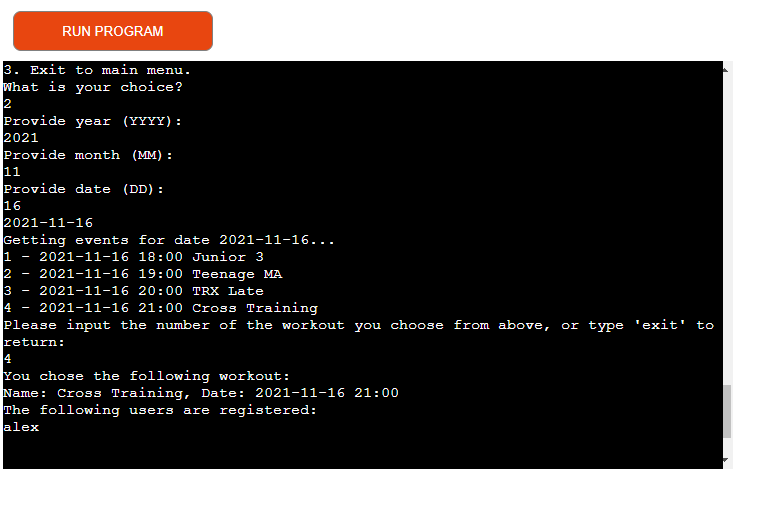

# TRXtreme Booking System
In order to view the live site, click [here](https://trxtreme.herokuapp.com/).

If you want to view the Google Calendar, click [here](https://calendar.google.com/calendar/u/0?cid=dHJ4dHJlbWUyMDIxQGdtYWlsLmNvbQ). To view, you have to add the calendar to your Google account. You can remove it anytime you wish after that.

If you want to view the Google Sheet used for data storage, click [here](https://docs.google.com/spreadsheets/d/1izyPTgGIt_uKegNn2I0lFUdrAuXPJisNeXgvzN2EG_g/edit?usp=sharing).

TRXtreme is a booking system for a martial arts school that also offers TRX and Cross Training workouts. 
The system was built based on a real place and the way it works, coupled with many personal preferences/improvements. 
It offers options for first time users, signed up users and administrators.

## Table of contents:

1. [User Stories](#user-stories)
2. [Goals](#goals)
3. [User Manual](#user-manual)
4. [Features](#features)
5. [Structure](#structure)
6. [Technologies used](#technologies-used)
7. [Testing](#testing)
    1. [Validation](#validation)
    3. [User stories testing](#user-stories-testing)
8. [Bugs](#bugs)
9. [Deployment](#deployment)
10. [Credits](#credits)

## User Stories:

### As a first time user, I want to:
1. Be able to sign up.
2. Have the option to sign up for the appropriate martial arts level.
3. Find the menu options easily.

### As a recurring martial arts user, I want to:
4. Have easy sign in option.
5. See my next martial arts class.

### As a recurring workouts user, I want to:
6. Have easy sign in option.
7. Be able to sign up for the workout I want.
8. See how many workouts I have left. 
9. Not be able to register for the same workout twice.

### As the administrator, I want to:
10. Be able to see registered users for specific classes.
11. Have the option to view user data.
12. Have the option to edit user data.

## Goals:
### Development goals:
* Have an efficient way to store data and use it.
* Use both Google Calendar and Sheet to have better structure.
* Provide easy navigation that can escape back to main menu.

### Target audience goals:
* Provide an intuitive menu.
* Have easy to understand options.
* Provide options for both administrators and users.

## User manual:

Before reading the instructions, some important notes need to be made.

* Users have 2 categories. Workout and Martial Arts.

    * Workout users go to either TRX or Cross Training.
    * They have a set amount of workouts per month that they can attend to. That amount is controlled by the trainer.
    * When they sign up, they have 0 workouts remaining, as the trainer(admin) has to add them.
    * They have to sign up for a workout each time they want to visit. 
  
    * Martial arts users take classes in martial arts.
    * They are in a class according to their level.
    * They do not pick their trainings. They have classes whenever their level is on schedule.

### 1. Main Menu

Screenshot

This is the first screen you will see when running the app. Here, you have the options: 
* [Sign in as user](#2-sign-in-as-user)
* [Sign up as user](#3-sign-up-as-user)
* [Sign in as admin](#4-sign-in-as-admin)

### 2. Sign in as user

Screenshot

Here you can sign in as a user with your username and email.
After that, you either get told when  your next class is if you are a martial arts user, or get the following options if you are a workout user:
1. [Sign up for workout](#sign-up-for-workout)
2. [View workouts left](#view-workouts-left)
3. [Exit to main menu](#1-main-menu)

### 3. Sign up as user

Screenshot

Here you can sign up to create a user account. You will be asked to provide the following details:
 * Username: Between 4-15 characters. Must not exist in database.
 * Email: Between 10-50 characters. Must not exist in database.
 * First name: Between 2-30 characters.
 * Last name: Between 2-30 characters.
Then, you must choose if you are a workouts user or martial arts. 
 * Workouts: You will not be asked anything else, you are ready! 
 * Martial arts: Pick your level to be assigned to class.

If you input "exit" during the username or email prompts, you will be returned to the main menu.

### 4. Sign in as admin

Screenshot

The "admin credentials" are in the Google Sheet page "users" and are by default "admin" and "password". They can only be changed there.

The admin menu provides the following options:
1. [View and edit users](#view-and-edit-users)
2. [View workouts](#view-workouts)
3. [Exit to main menu](#1-main-menu)

### 5. Sign up for workout

Screenshot

In the workout sign up section, you can see the next workouts (TRX and Cross Training) and choose one that you want to sign up for.
You then have to input "y" to confirm or "n" to cancel. Confirming will use one of your workouts left.

### 6. View workouts left

Screenshot

If you press this button, the app will show you how many workouts you have left.
Only the admin can add more!

### 7. View and edit users

Screenshot

Here the admin can view user data when searching by their username. After that, they can input 1 to edit the data.
If they choose to edit, they can edit any piece of information the user has. The only exception is that they cannot alter the next workouts.

### 8. View workouts

Screenshot

Here the admin has to choose the year, month and day in the format of YYYY, MM and DD sequentially.
After that they get a numbered list of all workouts on that day. 
By then inputting the number of the workout they want to view, they get information about all the users that will attend.

## Features:

### Main menu:

* Provides welcome message. 
* Gives users and administrators the options.

#### User stories covered: 4

### User sign in:

* Asks users for their username and email.
* Informs them if the username or email is incorrect.
* Provides escape option.

#### User stories covered: 5, 7

### Workout user options menu:

* Provides user options appropriate to workout users.
* Gives the option of either signing up for a workout or viewing their remaining workouts.
* Provides escape option.

#### User stories covered: 8, 9

### Workout sign up:

* Provides next workouts.
* Gives the user easy picking option.
* Verifies if the user is sure they want to sign up.
* Does not let user sign up more than once.

#### User stories covered: 8, 10

### Remaining workouts:

* Provides the user with information on their remaining workouts.

#### User stories covered: 9

### Sign up:

* Provides the user with the sign up menu.
* Verifies if username or email already exist in database.
* Validates data based on length.

#### User stories covered: 1

### Martial arts sign up class:

* Provides the signing up user with a choice of classes.
* Checks if selected class has less than 12 people.

#### User stories covered: 3

### Admin class & workout viewer:

* Provides the administrator with information on classes/workouts.
* Easy to use date picker, based on numbered list.

#### User stories covered: 11

### Admin user viewer:

* Provides the administrator with information on selected user.
* Gives all user information and provides option to edit.

#### User stories covered: 12

### Admin user editor:

* Provides the administrator with user data editing options.
* Easy to use data picker, based on numbered list.

#### User stories covered: 13

## Structure: 
The system's structure was designed as a flowchart first. To design the flowchart, I used [Lucidchart](https://www.lucidchart.com/).

## Technologies used:

### Languages
* Python

### Frameworks and tools
* VSCode
* Google Cloud API
* Google Sheets API
* Google Calendar API
* Lucidchart

### Data Modeling
This project uses some data models more than others.  \
Google Sheets are used to store user data in the "users" sheet. The rest of the sheets are unique for each event, named after the event ID.  \
Google Calendar is only used to read from, so we can have the schedule for each day. No manipulation is done, as OAuth is needed for that.  \
  \
I have tried keeping it as simple as possible, so here are the main points:
* A main user class (user.User) and its subclasses (user.WorkoutUser and user.MartialArtsUser) are used to create an object and pass it around our functions. The object is usually called user_class. It is used to take the information from our Google Sheets "user" sheet and store it for easy access. We can change any attributes we want and then use the object to return the new data.
* Many lists have been used to store data throughout the project, like events_list. They are mainly used to store a list of events, or a list of attendees. The manipulation is done either through appending more data to create a complete list, or taking data through the API (like a whole Google Sheets column) and storing it.
* event_id has been used a lot, as it is a unique identifier for each event. It is used to store event data, like when a user signs up for a workout. If a sheet with the event ID name exists, it adds the user. If not, a new one is created with the event ID name and the user is added.
* Counters have been used throughout the project, mainly named "index" or "counter". They are necessary as we have to iterate through lists (rows and columns) and need to know where the data is located. Google Sheets works with numbers for indices, so we need to count them.

### 3rd party libraries
* googleapiclient.discovery - Necessary to import build so we can create the resource to communicate with Google Calendar. For more information, you can read the documentation [here](https://googleapis.github.io/google-api-python-client/docs/epy/googleapiclient.discovery-module.html#build).
* google.oauth2.service_account - Module used to implement OAuth to our project. Even though we don't use authentication for this project, it is necessary to connect our Service Account with the Credentials function. Read more about it [here](https://google-auth.readthedocs.io/en/master/reference/google.oauth2.service_account.html).

## Testing:
### Validation

 PEP8 

The PEP8 online requirements validator was used as the main validator for this project.
No errors were left after cleaning up the code.

### run.py:

### gservices.py:

### user.py:

### user_data.py:

 Pylint 

Pylint was used as a secondary linter/validator.
There are some errors, which have an explanation as to why they were left unchanged.

### run.py:
\
E1101: no-member -> The "events" member is used only for Google API operations and it is written to function correctly.  \
W0702: bare-except -> The try/except blocks were used to catch any type of error, to see if the selected event does not exist.  \
R1723: no-else-break -> There is an else after break, as the break is to stop our infinite loop.  \
R0912: too-many-branches -> Tried to reduce branches, yet they are necessary for the operation.  \
### gservices.py:

### user.py:
\
R0913: too-many-arguments -> As our classes were used for easy data manipulation, they have more arguments than usual.  \
R0903: too-few-public-methods -> Again same issue. Our classes were used for data manipulation, so they did not need any methods.  \
### user_data.py:

### User stories testing:

1. Be able to sign up.

| **Feature** | **Action** | **Expected Result** | **Actual Result** |
|-------------|------------|---------------------|-------------------|
| Sign up | In main menu, press 2. Sign up | Get sign up menu | Works as expected |
| Sign up | After getting sign up menu, input data | Be informed if data is incorrect | Works as expected |
| Sign up | After getting sign up menu, input data | Be informed if sign up was successful | Works as expected |

Screenshots

2. Have the option to sign up for the appropriate martial arts level.

| **Feature** | **Action** | **Expected Result** | **Actual Result** |
|-------------|------------|---------------------|-------------------|
| Sign up | When martial arts is chosen, provide options for level | After choosing martial arts in sign up, levels appear as options to select | Works as expected |

Screenshots

3. Find the menu options easily.

| **Feature** | **Action** | **Expected Result** | **Actual Result** |
|-------------|------------|---------------------|-------------------|
| Main menu | Open application | See list of options | Works as expected |

Screenshots

4. Have easy sign in option.

| **Feature** | **Action** | **Expected Result** | **Actual Result** |
|-------------|------------|---------------------|-------------------|
| Sign in | Press 1 on main menu and input username and email | Successfully sign in | Works as expected |

Screenshots

5. See my next martial arts class.

| **Feature** | **Action** | **Expected Result** | **Actual Result** |
|-------------|------------|---------------------|-------------------|
| Martial arts user sign in | Sign in as martial arts user | See next workout | Works as expected |

Screenshots

6. Have easy sign in option.

| **Feature** | **Action** | **Expected Result** | **Actual Result** |
|-------------|------------|---------------------|-------------------|
| Sign in | Press 1 on main menu and input username and email | Successfully sign in | Works as expected |

Screenshots

7. Be able to sign up for the workout I want.

| **Feature** | **Action** | **Expected Result** | **Actual Result** |
|-------------|------------|---------------------|-------------------|
| Workout sign up | Sign in as workout user, press 1, choose workout | User signed up for workout | Works as expected |

Screenshots

8. See how many workouts I have left. 

| **Feature** | **Action** | **Expected Result** | **Actual Result** |
|-------------|------------|---------------------|-------------------|
| Remaining workouts | Sign in as workout user, press 2 | See how many workouts user has left | Works as expected |

Screenshots

9. Not be able to register for the same workout twice.

| **Feature** | **Action** | **Expected Result** | **Actual Result** |
|-------------|------------|---------------------|-------------------|
| Workout sign up | Sign in as workout user, press 1, choose workout that user is already signed up for | User gets warning message, does not get registered twice | Works as expected |

Screenshots

10. Be able to see registered users for specific classes.

| **Feature** | **Action** | **Expected Result** | **Actual Result** |
|-------------|------------|---------------------|-------------------|
| Admin class & workout viewer | Sign in as admin, press 1, input user's username | View user's data | Works as expected |

Screenshots

11. Have the option to view user data.

| **Feature** | **Action** | **Expected Result** | **Actual Result** |
|-------------|------------|---------------------|-------------------|
| Admin user view | Sign in as admin, press 2, input date, pick workout/class | View workout/class users | Works as expected |

Screenshots

12. Have the option to edit user data.

| **Feature** | **Action** | **Expected Result** | **Actual Result** |
|-------------|------------|---------------------|-------------------|
| Admin user edit | Sign in as admin, press 1, input user's username then press 1 again | Pick user data and change it | Works as expected |

Screenshots

## Bugs

1. Datetime provided to get events list from Google Calendar not accepted.
   * Change timezone letter from "B" which is the local one to "Z" which is UTC+0.
2. Infinite loops would continue running after calling other functions.
   * Add "break" after function calling event.
3. When checking to see if a sheet for the selected events exists, we would get an error if it does not exist, instead of getting "Null".
   * Add try/except for error catching, where except will set the checking variable to "Null" to be used as condition.
4. Trying to add attendees to Google Calendar gave authentication errors.
   * Changed strategy. Instead of adding attendees to Google Calendar, data is stored in Sheets, where each event that is used has a sheet with the event ID as name, thus it is unique.
5. pip3 freeze did not provide necessary requirements
   * Installed google services again with "--user" command, then the freeze command worked as intended.

## Deployment:
The website was deployed with [Heroku](https://www.heroku.com/). 

Before deploying to Heroku, you can fork the repository by following these steps:
1. Go to the GitHub repository (Where you are now)
2. Click on the Fork button in the top right corner of the page

To deploy on Heroku, the following steps were performed:
1. When the project was completed, I used the command "pip3 freeze > requirements.txt" to add all requirements to said file.
2. Visit Heroku page and either sign in or sign up.
3. Click "New" on the top-right and click "Create new app".
4. Add app name and choose region, then click "Create app".
5. Go to "Settings" tab of project and click "Reveal Config Vars" in Config Vars.
6. For the first one, type "CREDS" for name and for value use the credentials for your Google API service account. (Detailed below)
7. For the second one, type "PORT" and for value type "8000".
8. Click "Add buildpack" below the Config Vars section.
9. Choose "python", press "Save changes" then do the same for "node.js".
10. Make sure python is above node.js!
11. Go to "Deploy" section.
12. Make sure the "main" or "master" branch is selected and click "Enable automatic deploys"
Done!

For the Google APIs, one must do the following to get set:
1. Sign in or create an account for the [Google Cloud Platform](https://console.cloud.google.com/).
2. Click the "New Project" button and complete the details.
3. Hover over "APIs and services" and click on "Library".
4. Search for the Google Drive and enable it. Do the same for Google Sheets and Google Calendar.
5. Click on "APIs and services" and then on "Credentials".
6. Click "Manage service accounts" and then "Create service account".
7. Add a name for the account and a description if desired, then press "Create and continue".
8. Under "Role" choose "Editor", continue and then "Done".
9. Keep in mind that you need to change details in the gservices.py file.

## Credits:

Special thanks to my mentor Mo Shami. His insight is always appreciated and he has been very supportive and encouraging!
