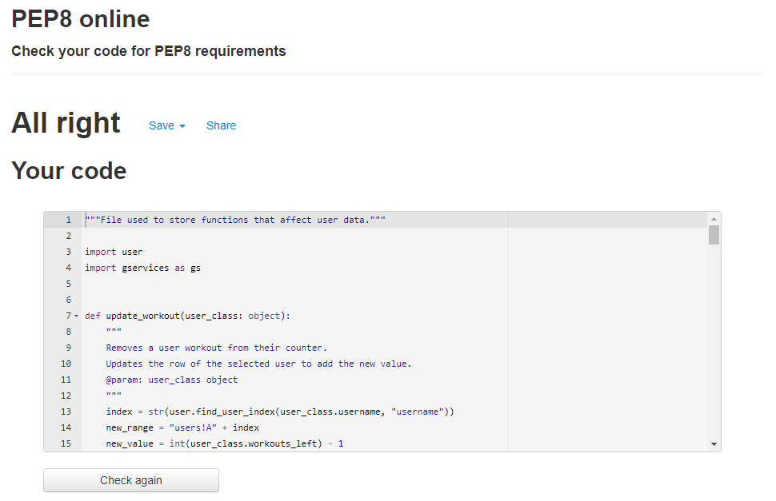

# TRXtreme Booking System
In order to view the live site, click [here](https://trxtreme.herokuapp.com/).

If you want to view the Google Calendar, click [here](https://calendar.google.com/calendar/u/0?cid=dHJ4dHJlbWUyMDIxQGdtYWlsLmNvbQ). To view, you have to add the calendar to your Google account. You can remove it anytime you wish after that.

If you want to view the Google Sheet used for data storage, click [here](https://docs.google.com/spreadsheets/d/1izyPTgGIt_uKegNn2I0lFUdrAuXPJisNeXgvzN2EG_g/edit?usp=sharing).

TRXtreme is a booking system for a martial arts school that also offers TRX and Cross Training workouts. 
The system was built based on a real place and the way it works, coupled with many personal preferences/improvements. 
It offers options for first time users, signed up users and administrators.

## Table of contents:

1. [User Stories](#user-stories)
2. [Goals](#goals)
3. [Features](#features)
4. [Design](#design)
    1. [Colours](#colours)
    2. [Fonts](#fonts)
    3. [Structure](#structure)
    4. [Wireframes](#wireframes)
5. [Technologies used](#technologies-used)
6. [Testing](#testing)
    1. [Validation](#validation)
    2. [Device and browser testing](#device-and-browser-testing)
    3. [User stories testing](#user-stories-testing)
7. [Bugs](#bugs)
8. [Deployment](#deployment)
9. [Credits](#credits)

## User Stories:

### As a first time user, I want to:
1. Be able to sign up.
2. Have the option to sign up for the appropriate martial arts level.
3. Find the menu options easily.

### As a recurring martial arts user, I want to:
4. Have easy sign in option.
5. See my next martial arts class.

### As a recurring workouts user, I want to:
6. Have easy sign in option.
7. Be able to sign in for the workout I want.
8. See how many workouts I have left. 
9. Not be able to register for the same workout twice.

### As the administrator, I want to:
10. Be able to see registered users for specific classes.
11. Have the option to view user data.
12. Have the option to edit user data.

## Goals:
### Development goals:
* Have an efficient way to store data and use it.
* Use both Google Calendar and Sheet to have better structure.
* Provide easy navigation that can escape back to main menu.

### Target audience goals:
* Provide an intuitive menu.
* Have easy to understand options.
* Provide options for both administrators and users.

## Features:

### Main menu:

* Provides welcome message. 
* Gives users and administrators the options.

#### User stories covered: 4

### User sign in:

* Asks users for their username and email.
* Informs them if the username or email is incorrect.
* Provides escape option.

#### User stories covered: 5, 7

### Workout user options menu:

* Provides user options appropriate to workout users.
* Gives the option of either signing up for a workout or viewing their remaining workouts.
* Provides escape option.

#### User stories covered: 8, 9

### Workout sign up:

* Provides next workouts.
* Gives the user easy picking option.
* Verifies if the user is sure they want to sign up.
* Does not let user sign up more than once.

#### User stories covered: 8, 10

### Remaining workouts:

* Provides the user with information on their remaining workouts.

#### User stories covered: 9

### Sign up:

* Provides the user with the sign up menu.
* Verifies if username or email already exist in database.
* Validates data based on length.

#### User stories covered: 1

### Martial arts sign up class:

* Provides the signing up user with a choice of classes.
* Checks if selected class has less than 12 people.

#### User stories covered: 3

### Admin class & workout viewer:

* Provides the administrator with information on classes/workouts.
* Easy to use date picker, based on numbered list.

#### User stories covered: 11

### Admin user viewer:

* Provides the administrator with information on selected user.
* Gives all user information and provides option to edit.

#### User stories covered: 12

### Admin user editor:

* Provides the administrator with user data editing options.
* Easy to use data picker, based on numbered list.

#### User stories covered: 13

## Structure: 
The system's structure was designed as a flowchart first. To design the flowchart, I used [Lucidchart](https://www.lucidchart.com/).

## Technologies used:

### Languages
* Python

### Frameworks and tools
* VSCode
* Google Cloud API
* Google Sheets API
* Google Calendar API
* Lucidchart

## Testing:
### Validation

 PEP8 

The PEP8 online requirements validator was used as the main validator for this project.
No errors were left after cleaning up the code.

### run.py:

### gservices.py:

### user.py:

### user_data.py:

 Pylint 

Pylint was used as a secondary linter/validator.
There are some errors, which have an explanation as to why they were left unchanged.

### run.py:

E1101: no-member -> The "events" member is used only for Google API operations and it is written to function correctly.
W0702: bare-except -> The try/except blocks were used to catch any type of error, to see if the selected event does not exist.
R1723: no-else-break -> There is an else after break, as the break is to stop our infinite loop.
R0912: too-many-branches -> Tried to reduce branches, yet they are necessary for the operation.
### gservices.py:

### user.py:

R0913: too-many-arguments -> As our classes were used for easy data manipulation, they have more arguments than usual.
R0903: too-few-public-methods -> Again same issue. Our classes were used for data manipulation, so they did not need any methods.
### user_data.py:

### User stories testing:

1. Be able to sign up.

| **Feature** | **Action** | **Expected Result** | **Actual Result** |
|-------------|------------|---------------------|-------------------|
| Sign up | In main menu, press 2. Sign up | Get sign up menu | Works as expected |
| Sign up | After getting sign up menu, input data | Be informed if data is incorrect | Works as expected |
| Sign up | After getting sign up menu, input data | Be informed if sign up was successful | Works as expected |

Screenshots

2. Have the option to sign up for the appropriate martial arts level.

| **Feature** | **Action** | **Expected Result** | **Actual Result** |
|-------------|------------|---------------------|-------------------|
| Sign up | When martial arts is chosen, provide options for level | After choosing martial arts in sign up, levels appear as options to select | Works as expected |

Screenshots

3. Find the menu options easily.

| **Feature** | **Action** | **Expected Result** | **Actual Result** |
|-------------|------------|---------------------|-------------------|
| Main menu | Open application | See list of options | Works as expected |

Screenshots

4. Have easy sign in option.

| **Feature** | **Action** | **Expected Result** | **Actual Result** |
|-------------|------------|---------------------|-------------------|
| FEATURE | ACTION | EXPECTED RESULT | Works as expected |

Screenshots

5. See my next martial arts class.

| **Feature** | **Action** | **Expected Result** | **Actual Result** |
|-------------|------------|---------------------|-------------------|
| FEATURE | ACTION | EXPECTED RESULT | Works as expected |

Screenshots

6. Have easy sign in option.

| **Feature** | **Action** | **Expected Result** | **Actual Result** |
|-------------|------------|---------------------|-------------------|
| FEATURE | ACTION | EXPECTED RESULT | Works as expected |

Screenshots

7. Be able to sign in for the workout I want.

| **Feature** | **Action** | **Expected Result** | **Actual Result** |
|-------------|------------|---------------------|-------------------|
| FEATURE | ACTION | EXPECTED RESULT | Works as expected |

Screenshots

8. See how many workouts I have left. 

| **Feature** | **Action** | **Expected Result** | **Actual Result** |
|-------------|------------|---------------------|-------------------|
| FEATURE | ACTION | EXPECTED RESULT | Works as expected |

Screenshots

9. Not be able to register for the same workout twice.

| **Feature** | **Action** | **Expected Result** | **Actual Result** |
|-------------|------------|---------------------|-------------------|
| FEATURE | ACTION | EXPECTED RESULT | Works as expected |

Screenshots

10. Be able to see registered users for specific classes.

| **Feature** | **Action** | **Expected Result** | **Actual Result** |
|-------------|------------|---------------------|-------------------|
| FEATURE | ACTION | EXPECTED RESULT | Works as expected |

Screenshots

11. Have the option to view user data.

| **Feature** | **Action** | **Expected Result** | **Actual Result** |
|-------------|------------|---------------------|-------------------|
| FEATURE | ACTION | EXPECTED RESULT | Works as expected |

Screenshots

12. Have the option to edit user data.

| **Feature** | **Action** | **Expected Result** | **Actual Result** |
|-------------|------------|---------------------|-------------------|
| FEATURE | ACTION | EXPECTED RESULT | Works as expected |

Screenshots

## Bugs

1. BUG DESCRIPTION
   * BUG FIX DESCRIPTION

## Deployment:
* The site was deployed to GitHub pages. The steps to deploy are as follows: 
  * In the GitHub repository, navigate to the Settings tab 
  * From the source section drop-down menu, select the Master Branch
  * Once the master branch has been selected, the page will be automatically refreshed with a detailed ribbon display to indicate the successful deployment. 

The live link can be found here - LINK

## Credits:

* ADD CREDITS HERE